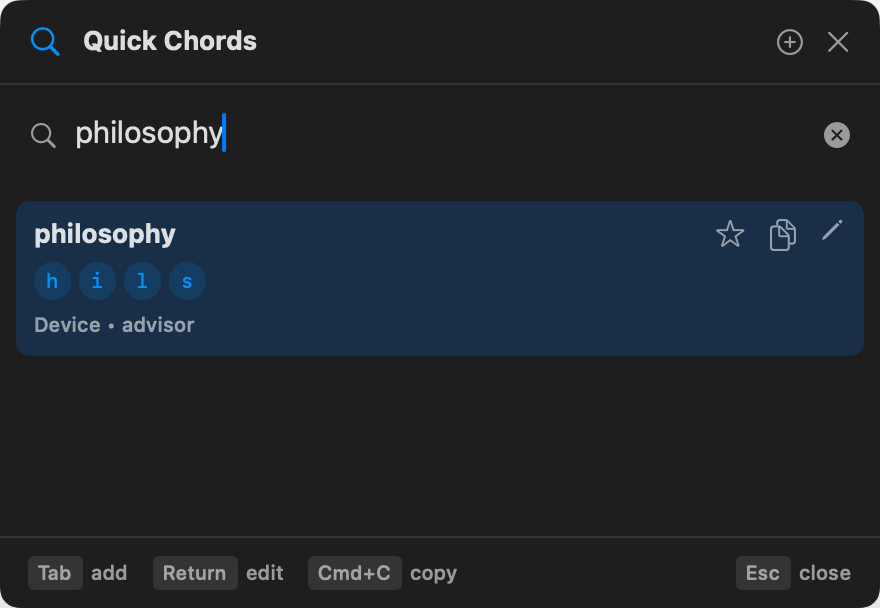
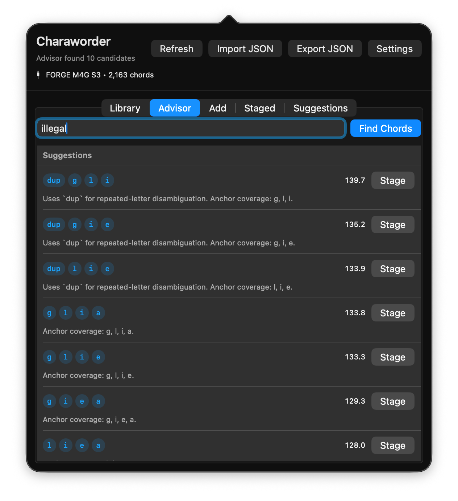

# Chordsmith Mac

Chordsmith Mac is an unofficial macOS chord manager and deterministic advisor for CharaChorder.

It is built for fast local search, quick chord editing, M4G-aware suggestions, and safer device writes. It is a separate project and is not affiliated with, endorsed by, or maintained by CharaChorder.

## Screenshots





## What It Does

- Search an M4G chord library by output text, visible chord input, source, flags, macros, and action tokens.
- Add, edit, delete, and star chords from a compact floating quick panel.
- Suggest M4G chords using deterministic validation rather than AI.
- Reject physically impossible M4G inputs, including same-switch and same thumb-lane conflicts.
- Preserve raw device actions for non-plain and macro chords.
- Import and export CharaChorder chord JSON.
- Commit staged device changes directly to the connected M4G.
- Queue failed device writes for later retry instead of freezing the UI.

## Grow: Add Chords In Batches

The **Grow** tab ranks the words that cost you the most time typed letter by
letter over the last 7, 30 or 90 days, and gives each one a chord. Every first
choice is conflict-free against your library and against the words ranked
above it, so you can select the top 5, 10 or 25, stage them in one go, check
them in **Staged**, and commit them to the M4G as a single batch.

- Inflections of words you already chord (`running` from `run`) are shown as
  endings and get the base chord plus one marker key.
- Likely typos of chorded words (`hte`, `waht`), half-typed fragments finished
  by shell completion, and Arabic words are kept out of the list.
- Skip a word to stop it being suggested; restore it from the Skipped section.

## Practice

The **Practice** tab turns the recorder's data into drills:

- **You have a chord but typed it**: words with a chord that you still type
  letter by letter, with how often you chorded them instead.
- **New chords to adopt**: chords added from Chordsmith in the last 30 days,
  until you mark them learned.
- **Typos a chord would have prevented**.
- **Drills** of five words at a time: chord each word into the field, see your
  time and chords per minute, repeat with the chord hidden, then move on.

## Advisor

The advisor is local and deterministic. It uses:

- the current M4G physical model;
- exact raw-input conflict checks;
- anchor-letter weighting for distinctive letters;
- English morphology such as plurals, `-ing`, `-ed`, `-tion`, `-ive`, and `un-`;
- existing family chords, such as extending `necessary -> n+e+c` into `unnecessary -> n+e+c+u`;
- starred chords as local feedback for preferred chord style.

Hard validation always wins. A candidate is rejected if it conflicts with an existing raw input, uses unsupported actions, repeats a physical key, collides on a switch, or hits an impossible thumb lane.

## Quick Panel

Default shortcuts:

- `Cmd+Shift+Space`: open the main panel.
- `Cmd+Option+Space`: open quick advisor.
- `Cmd+Shift+A`: open Quick Chords.
- double-tap `Control`: open Quick Chords.

Inside Quick Chords:

- `Tab`: switch between search and add.
- `Return`: edit the selected chord or save the current quick add.
- `Cmd+C`: copy selected output.
- arrow keys: move through search results or advisor candidates.
- `Esc`: close.

## Device Workflow

The normal workflow is:

1. Stage a chord add, edit, or delete.
2. Commit.

Commit applies the local database change and writes only that staged device mutation to the M4G. It does not run a full device reconciliation as part of the normal flow. If the device write fails, the local change stays committed and the failed device mutation is queued for retry.

## Install And Start At Login

Requirements:

- macOS 13 or newer
- Xcode command line tools or Xcode
- Swift 6.2 toolchain

Build a signed local app bundle, install it in `~/Applications`, and launch it:

```sh
./scripts/install_app.sh
```

On its first bundled launch, Chordsmith registers the main app with macOS 13+
Service Management. It then runs as an efficient menu-bar app at each login.
You can disable it or open macOS Login Items from Chordsmith Settings.

On first launch, grant **Input Monitoring** when macOS asks. If it is not yet
enabled, open Chordsmith's **Usage** tab and choose **Input Monitoring…**, then
enable Chordsmith in **System Settings › Privacy & Security › Input Monitoring**.
The recorder retries automatically when you return to Chordsmith. It remains
paused—and saves no words—until this permission is granted.

For a one-off development run, `swift run Chordsmith` still works, but launch at
login is intentionally unavailable outside an installed `.app` bundle.

Run tests:

```sh
swift test
```

## Data And Privacy

Chordsmith Mac stores local app data under macOS Application Support. The advisor runs locally and does not require an AI service or network access for chord generation.

The usage recorder requires macOS Input Monitoring permission. A Master Forge is one logical device made from separately enumerated left (`m4g_s3`) and right (`m4gr_s3`) digitizer halves. Chordsmith recognizes both halves by their USB HID descriptor and correlates each half's key-down with the corresponding macOS keyboard event. Unmatched events are recorded as normal keyboard input; if physical attribution is unavailable, the recorder does not save the word. The Usage tab shows whether one or both Master Forge halves are available for physical attribution.

Words stay editable until the next word starts: backspacing into a word you
just finished (as CCOS suffix modifiers and quick typo fixes do) reopens it, and
Option+Backspace discards it, so only the final word is counted. Clicks, arrow
keys, Return and shortcuts end the word.

Word detection uses Apple's on-device Natural Language tokenizer and Unicode normalization for English and Arabic. Arabic tashkeel and tatweel are removed from aggregate keys so visually equivalent spellings count together. Only normalized word-level frequency, timing, language, and source aggregates are stored; raw keystrokes, sentences, and application names are not persisted. SQLite runs in WAL mode with normal synchronization to minimize write overhead for an always-on recorder.

## License

MIT. See [LICENSE](LICENSE).

The software is provided as is, without warranty of any kind.
